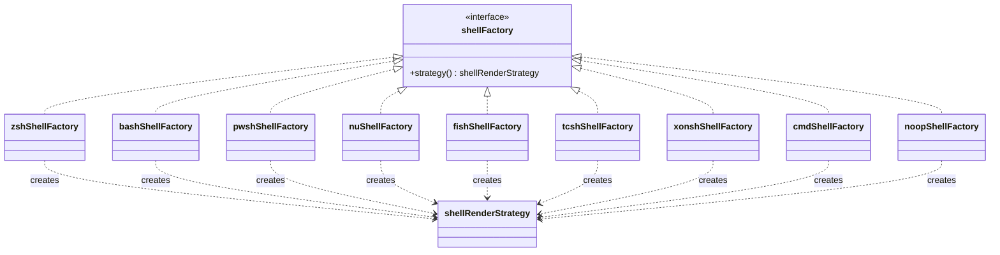
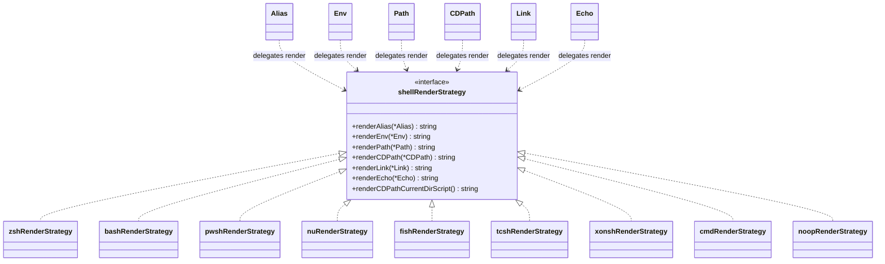
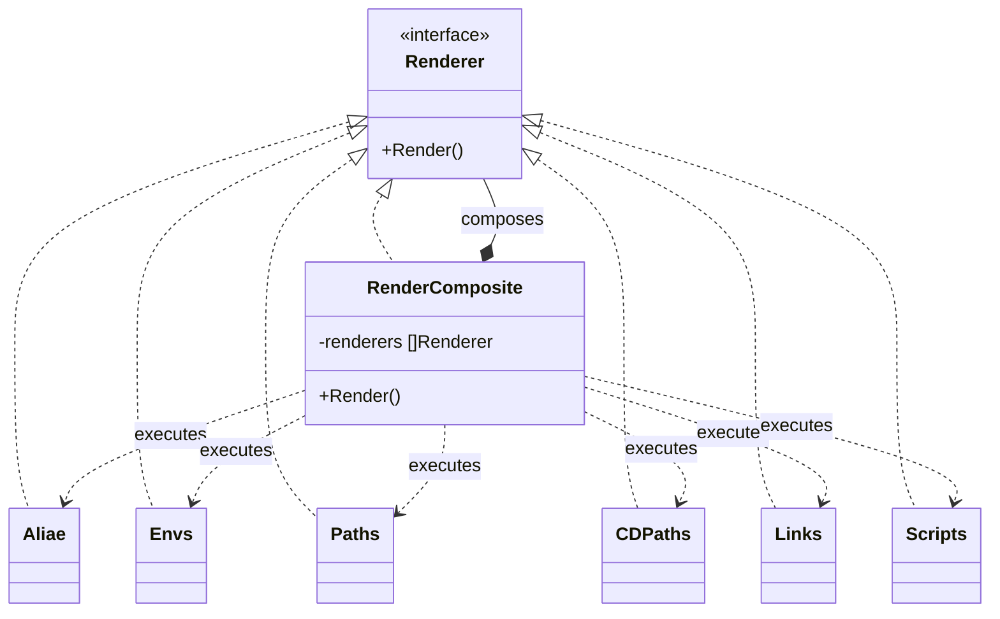

I wanted to have the same experience across all the shells I use when building/validating [Oh My Posh][omp].
It's the one feature which was missing when trying to build a seamless cross shell experience for tools you use every day.

## What does it do?

It allows you to use a single, template enabled `YAML` [configuration][config] to manage the following things:

- [Alias][alias]
- [Function][alias]
- [Precomputed variable (`var`)][templates]
- [Environment variable][env]
- [PATH entry][path]
- [CDPATH entry][cdpath]
- [Script][script]
- [Symbolic Link][link]

## Fork summary vs upstream main

This repository includes additional changes on top of
[`JanDeDobbeleer/aliae` `main`](https://github.com/JanDeDobbeleer/aliae/tree/main),
with emphasis on Git Bash compatibility and fork-owned release/documentation flows.

- Shell behavior and detection:
  - Added Scoop support and shim-aware shell detection behavior.
  - `init --tty-only` support and follow-up fixes for piped output handling.
  - `alias.type` now supports `python` and `perl` for inline interpreter source from `PATH`.
  - `script.type` now supports `python` and `perl` for inline interpreter source from `PATH`.
- `aliae get variables` diagnostics to print TTY checks and resolved template variables.
  - Git Bash shell detection fixes, including Scoop shim-aware parent process resolution.
- Shell resolution trace output in `aliae get variables`.
  - Windows Git Bash PATH delimiter handling fix.
  - Function description support for Fish (`function --description`) and Nushell
    (doc comment) when `description` is provided.
- Template capabilities:
  - `fileExists` and `dirExists` helpers.
  - `hasCommand` caching with `hasCommandNoCache` for uncached checks.
  - `progress` helper for OSC progress output and reset.
  - `.ConfigPath` and `.ConfigDir` template variables.
  - `.Env` template map for environment variable access like `{{ .Env.DOTFILES }}`.
  - Top-level `var` entries with precomputed values, available as `.Var.<Name>`.
  - `.Hostname` template variable that exposes the system hostname.
  - `.WSL` template variable that indicates Windows Subsystem for Linux runtime.
- PATH capabilities:
  - `ifExists` option to include only existing path entries.
  - `cdpath` support with shell-specific rendering and duplicate suppression.
- Configuration capabilities:
  - Top-level `cygpath` mode (`internal` by default, `external` optional) to choose conversion backend.
  - Top-level `cache` (enabled by default) to reuse merged+validated config when source files are unchanged.
  - Top-level `extends` with short/long syntax, cycle detection, and a depth limit.
  - Conditional `extends[].if` support to skip individual extends entries when false.
  - Top-level `progress` with weighted automatic OSC progress across `alias`, `env`, `path`, and `script`.
    `progress.internal` reserves a root-only internal init span before script output.
  - `env.isPath` option to normalize rendered path-valued env vars to OS-native separators.
  - `env.ifExists` option (with `isPath: true`) to export env vars only when the rendered directory exists.
  - Multiline path fallback for `env` values with `isPath: true`, using the first existing directory.
  - `aliae get config` command to print the fully resolved YAML configuration.
  - `aliae validate` command to validate raw config YAML against the schema.
  - `aliae validate` rejects unknown properties while runtime init remains permissive.
  - `script.state` support for run-once or `runEvery` scheduling with timestamp state files.
  - `aliae state` command group (`list` default, `clear`) to inspect and manage configured state files.
- Fork distribution and automation:
  - Fork-oriented installer/docs references for release artifacts.
  - Scoop/Homebrew bucket and tap population moved to dedicated external repositories.
- Workflow updates to align with fork publishing boundaries.

## Shell factory and strategy design patterns

The shell rendering layer combines Factory and Strategy:

- Factory selects which shell strategy to use.
- Strategy encapsulates shell-specific rendering behavior.
- Composite executes section renderers in a stable pipeline order.

### Factory class diagram

### Strategy class diagram

### Composite class diagram

## I want in

Great, all you need is to install and configure aliae on your machine and you're good to go. Find the installation guide
for your platform and have a look at the alias [configuration][config] page to get started.

[omp]: https://ohmyposh.dev
[config]: setup/configuration.mdx
[alias]: setup/alias.mdx
[templates]: setup/templates.mdx
[env]: setup/env.mdx
[path]: setup/path.mdx
[cdpath]: setup/cdpath.mdx
[script]: setup/script.mdx
[link]: setup/link.mdx
