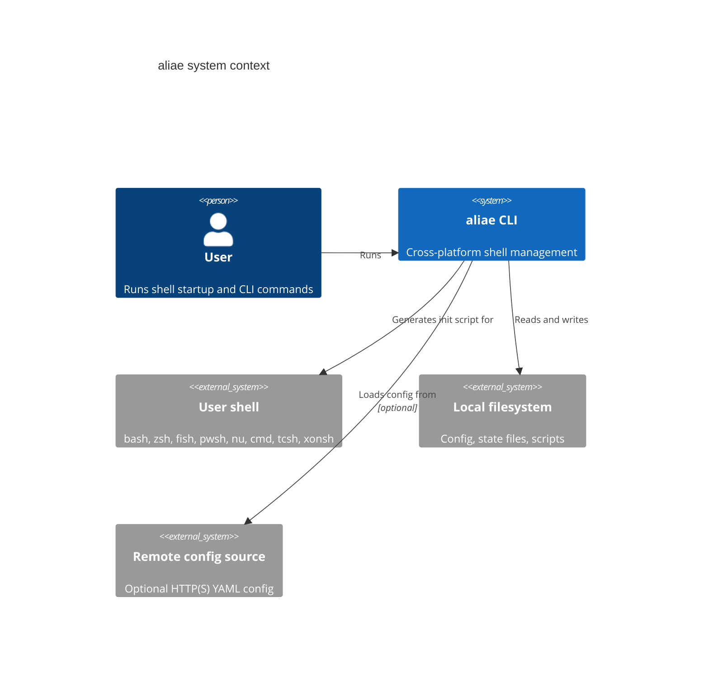
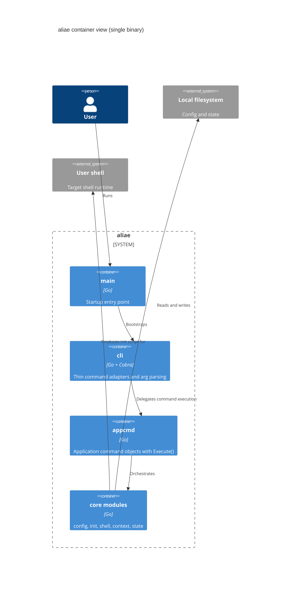
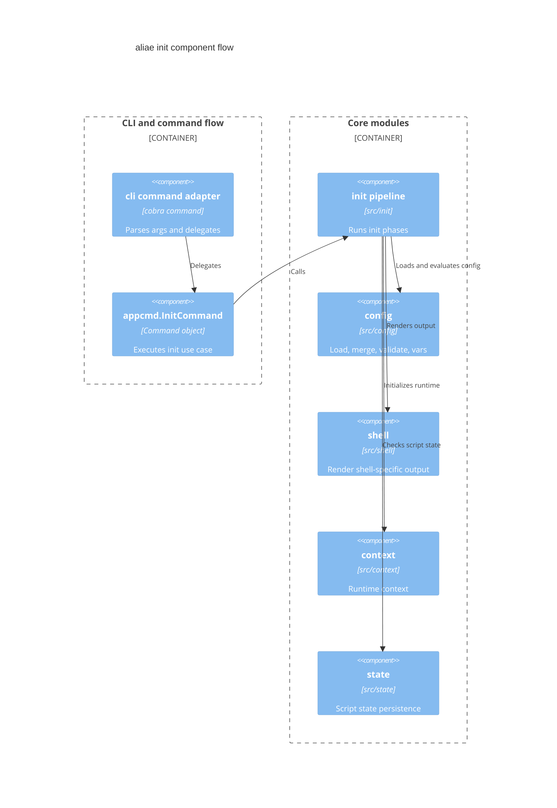

This page documents the current architecture of `aliae` in this fork.

## C1: System context

```mermaid
C4Context
    title aliae system context

    Person(user, "User", "Runs shell startup and CLI commands")
    System(aliae, "aliae CLI", "Cross-platform shell management")

    System_Ext(shell, "User shell", "bash, zsh, fish, pwsh, nu, cmd, tcsh, xonsh")
    System_Ext(files, "Local filesystem", "Config, state files, scripts")
    System_Ext(remoteCfg, "Remote config source", "Optional HTTP(S) YAML config")

    Rel(user, aliae, "Runs")
    Rel(aliae, shell, "Generates init script for")
    Rel(aliae, files, "Reads and writes")
    Rel(aliae, remoteCfg, "Loads config from", "optional")
```

## C2: Container view

```mermaid
C4Container
    title aliae container view (single binary)

    Person(user, "User")
    System_Boundary(aliae, "aliae") {
        Container(main, "main", "Go", "Startup entry point")
        Container(cli, "cli", "Go + Cobra", "Thin command adapters and arg parsing")
        Container(appcmd, "appcmd", "Go", "Application command objects with Execute()")
        Container(core, "core modules", "Go", "config, init, shell, context, state")
    }

    System_Ext(files, "Local filesystem", "Config and state")
    System_Ext(shell, "User shell", "Target shell runtime")

    Rel(user, main, "Runs")
    Rel(main, cli, "Bootstraps")
    Rel(cli, appcmd, "Delegates command execution")
    Rel(appcmd, core, "Orchestrates")
    Rel(core, files, "Reads and writes")
    Rel(core, shell, "Produces init script for")
```

## C3: Component flow for `aliae init`

```mermaid
C4Component
    title aliae init component flow

    Container_Boundary(cli, "CLI and command flow") {
        Component(cobra, "cli command adapter", "cobra command", "Parses args and delegates")
        Component(initCmd, "appcmd.InitCommand", "Command object", "Executes init use case")
    }

    Container_Boundary(core, "Core modules") {
        Component(initPipeline, "init pipeline", "src/init", "Runs init phases")
        Component(configMod, "config", "src/config", "Load, merge, validate, vars")
        Component(shellMod, "shell", "src/shell", "Render shell-specific output")
        Component(ctxMod, "context", "src/context", "Runtime context")
        Component(stateMod, "state", "src/state", "Script state persistence")
    }

    Rel(cobra, initCmd, "Delegates")
    Rel(initCmd, initPipeline, "Calls")
    Rel(initPipeline, ctxMod, "Initializes runtime")
    Rel(initPipeline, configMod, "Loads and evaluates config")
    Rel(initPipeline, shellMod, "Renders output")
    Rel(initPipeline, stateMod, "Checks script state")
```
