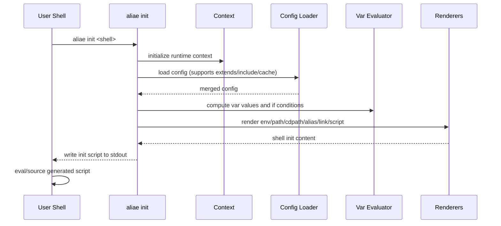

By default, aliae expects a `YAML` file called `.aliae.yaml` in the user `HOME` folder.
You can however also specify a custom location using the `--config` flag on initialization, or
by setting the `ALIAE_CONFIG` environment variable prior to initialization.

```zsh
eval "$(aliae init zsh --config '/Users/aliae/configs/aliae.yaml')"

# alternatively

export ALIAE_CONFIG='/Users/aliae/configs/aliae.yaml'
eval "$(aliae init zsh)"
```

The custom location can be a local file, or a URL pointing to a remote config.

## Top-level settings

<!-- markdownlint-disable MD060 -->
| Name           | Type          | Description                                                        |
| -------------- | ------------- | ------------------------------------------------------------------ |
| `stat_timeout` | `string`      | filesystem stat/existence timeout (default: `1s`, example `250ms`) |
| `cygpath`      | `string`      | cygpath backend mode: `internal` (default) or `external`          |
| `cache`        | `bool`        | enable root-level merged+validated config cache (default: `true`) |
| `progress`     | `bool/object` | automatic OSC progress output (default: `false`)                  |
| `var`          | `array`       | precomputed template variables exposed as `.Var.<Name>`           |
<!-- markdownlint-enable MD060 -->

When `progress` is enabled, aliae distributes progress across included `alias`, `env`, `path`, and `script` items.
Items skipped by `if` are excluded from the calculation.
Set `end_percentage: reset` to emit a final 100% update and then reset the progress state.
You can also use `progress: true` as shorthand for `start_percentage: 0` with `end_percentage: reset`.
Set `internal` to reserve an initial span for internal init processing before script output is generated.
`progress.internal` is read only from the root configuration file and is ignored in included or extended files.
Internal progress OSC codes are written to `stderr`, allowing them to render before `eval`
processes the init script from `stdout`.
`cache` is read only from the root configuration file and is ignored in included or extended files.
Set `cache: false` if you want to disable cache reuse.

## Init sequence



## Example

```yaml
# yaml-language-server: $schema=https://trajano.github.io/aliae/schema.json
stat_timeout: 1s
cygpath: internal
cache: true
progress:
  start_percentage: 21.44
  internal: 10
  end_percentage: reset
var:
  - name: WORKSPACE
    value: '{{ .Home }}/src'
alias:
  - name: a
    value: aliae
  - name: hello-world
    value: echo "hello world"
    type: function
env:
  - name: POSH_THEME
    value: '{{ if match .OS "darwin"}}{{ .Home }}{{ else }}Y:{{ end }}/.posh.omp.jsonc'
  - name: EDITOR
    value: code-insiders --wait
  - name: ANDROID_SDK_ROOT
    value: '{{ .Home }}/AppData/Local/Android/Sdk'
    isPath: true
    ifExists: true
  - name: ANDROID_HOME
    value: |
      {{ env "LOCALAPPDATA" }}/Android/Sdk
      {{ .Home }}/Library/Android/sdk
      {{ .Home }}/Android/Sdk
    isPath: true
path:
  - value: |
      {{ .Home }}/homebrew/bin
      /usr/local/bin/
      /opt/local/bin/
    if: match .OS "darwin"
  - value: |
      {{ .Home }}/go/bin/
    if: hasCommand "go"
cdpath:
  - value: |
      {{ .Home }}/src
      {{ .Home }}/work
script:
  - value: |
      oh-my-posh init nu
      source ~/.oh-my-posh.nu
    if: match .Shell "nu"
    weight: 1.5
  - value: |
      load(io.popen('oh-my-posh init cmd'):read("*a"))()
    if: match .Shell "cmd"
  - value: |
      oh-my-posh init pwsh | Invoke-Expression
    if: match .Shell "pwsh"
  - value: |
      xontrib load autovox
      xontrib load vox
      xontrib load voxapi
      xontrib load bashisms
      execx($(oh-my-posh init xonsh))
    if: match .Shell "xonsh"
  - value: |
      eval `oh-my-posh init tcsh`
    if: match .Shell "tcsh"
  - value: |
      eval "$(oh-my-posh init {{ .Shell }})"
    if: match .Shell "bash" "zsh"
  - value: |
      echo "workspace: {{ .Var.WORKSPACE }}"
    if: ne .Var.WORKSPACE ""
link:
  - name: ~/.aliae.yaml
    target: ~/dotfiles/aliae.yaml
  - name: ~/.zshrc
    target: $DOTFILES/config/zsh/zshrc
```

You can find out more about the configuration options below.

- [Alias][alias]
- [Function][alias]
- [Precomputed variable (`var`)][templates]
- [Environment variable][env]
- [PATH entry][path]
- [CDPATH entry][cdpath]
- [Script][script]
- [Symbolic link][link]

[alias]: setup/alias.mdx
[templates]: setup/templates.mdx
[env]: setup/env.mdx
[path]: setup/path.mdx
[cdpath]: setup/cdpath.mdx
[script]: setup/script.mdx
[link]: setup/link.mdx
